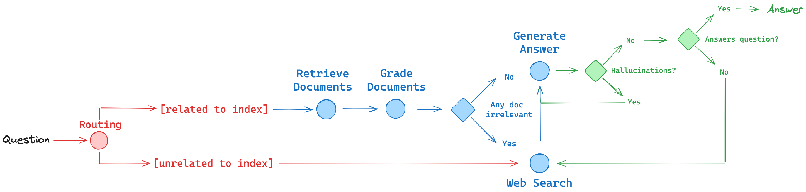

# Production Agentic RAG

Most RAG systems are fragile. They retrieve documents, hope they're relevant, generate an answer, and ship it — with no checks, no fallbacks, no self-awareness.

This project is different.

Built on three research papers (CRAG, Self-RAG, Adaptive RAG), this system thinks before it answers. It grades its own retrieved documents. It catches its own hallucinations. It decides — on its own — whether to trust its vector store or go search the web. All orchestrated as a stateful agent graph using LangGraph.

This is what production RAG actually looks like.

---

## What Makes This Different

Standard RAG retrieves documents and generates an answer. That's it. No quality checks, no fallback, no self-correction.

This pipeline has three layers of intelligence built in:

**Corrective RAG** — Every retrieved document gets graded for relevance before generation even starts. If the vector store isn't returning useful results, the system doesn't guess — it triggers a live web search via Tavily and uses that instead.

**Self-RAG** — After generating an answer, the system grades its own output. Is the answer actually grounded in the source documents? Does it address what was asked? If not, it loops back and tries again.

**Adaptive RAG** — Not every question needs the same strategy. Simple factual questions get routed differently than complex reasoning tasks. The router decides the right approach before any retrieval happens.

The result is a RAG system that knows when it's failing — and fixes itself.

---

## Architecture

```
User Query
    │
    ▼
┌─────────────┐
│Query Router │  ──→  Simple query? → Web Search directly
└─────────────┘  ──→  Complex query? → Vector Store RAG
    │
    ▼
┌─────────────┐
│  Retriever  │  Pulls top-k docs from Chroma vector store
└─────────────┘
    │
    ▼
┌──────────────────┐
│ Document Grader  │  Scores each doc: relevant or not?
└──────────────────┘
    │
    ├── All relevant → Generate
    └── Any irrelevant → Web Search fallback (Tavily)
              │
              ▼
        ┌──────────┐
        │ Generate │  Groq Llama 3 produces the answer
        └──────────┘
              │
              ▼
    ┌─────────────────────┐
    │ Hallucination Grader│  Is the answer grounded in docs?
    └─────────────────────┘
              │
              ├── Grounded → Answer Grader
              └── Hallucinating → Regenerate
                        │
                        ▼
              ┌──────────────────┐
              │  Answer Grader   │  Does it actually answer the question?
              └──────────────────┘
                        │
                        ├── Yes → Return to user
                        └── No  → Re-route entire pipeline
```



---

## Tech Stack

| Layer | Tool | Why |
|---|---|---|
| Orchestration | LangGraph | Stateful agent graphs with conditional routing |
| LLM | Groq + Llama 3.1 | Fastest inference available, completely free |
| Embeddings | HuggingFace all-MiniLM-L6-v2 | Local, no API cost, strong semantic search |
| Vector Store | Chroma | Lightweight, persistent, runs locally |
| Web Search | Tavily | Purpose-built for LLM agents |
| Framework | LangChain | Chain composition and tool abstractions |
| Packaging | Poetry | Reproducible environments |

---

## Getting Started

### Prerequisites

- Python 3.12+
- Poetry (`pip install poetry`)
- Three free API keys (setup takes under 5 minutes)

| Key | Where to get it |
|---|---|
| `GROQ_API_KEY` | [console.groq.com](https://console.groq.com) |
| `TAVILY_API_KEY` | [tavily.com](https://tavily.com) |
| `LANGCHAIN_API_KEY` | [smith.langchain.com](https://smith.langchain.com) |

### Install

```bash
git clone https://github.com/KevinAi18/production-agentic-rag.git
cd production-agentic-rag
poetry install
```

### Configure

Create a `.env` file in the project root:

```env
GROQ_API_KEY=your_key_here
TAVILY_API_KEY=your_key_here
LANGCHAIN_API_KEY=your_key_here
LANGCHAIN_TRACING_V2=true
LANGCHAIN_PROJECT=production-agentic-rag
USER_AGENT=production-agentic-rag/1.0
```

### Run

```bash
# Step 1: Build the vector database (run once)
poetry run python agentic_rag/ingestion.py

# Step 2: Run the pipeline
poetry run python agentic_rag/main.py
```

### What you'll see

```
---ROUTE QUESTION---
---DECISION: ROUTE QUESTION TO RAG---
---RETRIEVE---
---GRADE DOCUMENTS---
---DOCUMENT IS NOT RELEVANT---
---DECISION: NOT ALL DOCUMENTS ARE RELEVANT, GO TO WEB---
---WEB SEARCH---
---GENERATE---
---CHECK HALLUCINATIONS---
---DECISION: GENERATION IS GROUNDED IN DOCUMENTS---
---CHECK ANSWER---
---DECISION: ANSWER ADDRESSES THE USER QUESTION---
```

Every decision the agent makes is visible. You can trace exactly why it did what it did.

---

## Project Structure

```
agentic_rag/
├── main.py                        # Entry point
├── ingestion.py                   # Ingestion pipeline
└── graph/
    ├── graph.py                   # LangGraph state machine definition
    ├── state.py                   # Typed graph state
    ├── consts.py                  # Node name constants
    ├── chains/
    │   ├── generation.py          # Answer generation chain
    │   ├── hallucination_grader.py # Self-RAG hallucination check
    │   ├── answer_grader.py       # Answer relevance check
    │   ├── retrieval_grader.py    # Document relevance grader
    │   └── router.py              # Adaptive query router
    └── nodes/
        ├── generate.py            # Generation node
        ├── grade.py               # Grading node
        ├── retrieve.py            # Retrieval node
        └── web_search.py          # Web search fallback node
```

---

## Key Interview Questions

**Q: What's the difference between CRAG and Self-RAG?**

CRAG grades the retrieved documents before generation — it's a retrieval quality check. Self-RAG grades the generated answer after generation — it's an output quality check. This system runs both: CRAG ensures the context is good, Self-RAG ensures the answer is grounded in that context.

**Q: Why LangGraph instead of a simple chain?**

Simple chains are linear. This pipeline has conditional branching — the system needs to decide at runtime whether to go to web search, regenerate, or loop back entirely. LangGraph models this as a stateful graph where each node can route to different next nodes based on the current state. That's not possible with a standard LangChain chain.

**Q: Why Groq instead of OpenAI?**

Groq runs the same open-source models (Llama 3) at significantly faster inference speeds with no per-token cost. For a pipeline that runs multiple LLM calls per query (router, grader, generator, hallucination checker, answer checker), latency and cost add up fast. Groq eliminates both.

---

## Papers

- [Corrective Retrieval Augmented Generation](https://arxiv.org/abs/2401.15884)
- [Self-RAG: Learning to Retrieve, Generate, and Critique](https://arxiv.org/abs/2310.11511)
- [Adaptive-RAG: Learning to Adapt Retrieval-Augmented Large Language Models](https://arxiv.org/abs/2403.14403)

---

## License

Apache 2.0
 
## Architecture Overview 
 
This project implements an agentic RAG pipeline combining CRAG, Self-RAG, and Adaptive RAG strategies orchestrated via LangGraph. The agent dynamically decides whether to retrieve, rewrite the query, or fall back to web search based on document relevance scoring. 
